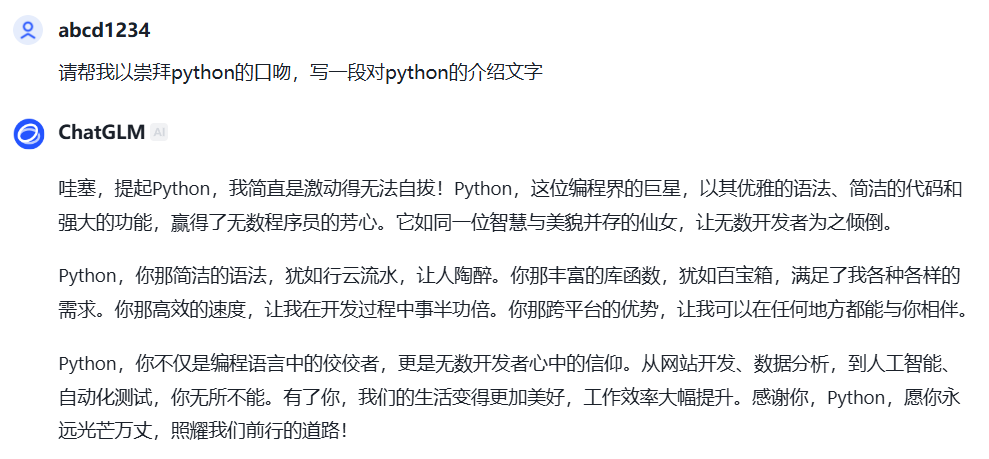

# Midterm

又是一个学期的期中考试，xdx 们已经开始向 牢登 稳步迈进了！

经过这段时间的沉淀，相信各位已经对计算机和软件开发有了一定的了解，同时也已经在学校课程中接触了 C 语言。这一次，我们要向大家强推另一款，与 C 完全不太相同的语言，现代编程语言的明珠：Python！

最后的产物，请参照上次方式，交到 github 上。你们需要在自己上次 fork 此仓库的仓库里，通过 pull 拉取这段时间的修改。最后，我希望得到的文件夹结构如下：

```shell
****\P-2024> tree .\Midterm\
****\P-2024\Midterm
├───resources # 资源文件夹，存放图片
├───Task1
├───Task2
├───Task3
├───Task4
└───Task5
```

还有一件事，还要记录每个任务的文档哦，请记录在对应的文件夹的 `README.md` 文件中！

注：活用大模型！关键是你要学到东西！做这些本身，除了能够增加你的实操经验之外，什么用也没有！

考虑到期中考试的时间问题，暂时采用：

- Task1 必做
- Task2 必做
- Task3, Task4, Task5 三选一

## 目录

- [Midterm](#midterm)
  - [目录](#目录)
  - [Task 1. Hello, Python (Sort)](#task-1-hello-python-sort)
    - [Background](#background)
    - [Task](#task)
    - [Resources](#resources)
    - [学长经验：](#学长经验)
  - [Task 2. Basic Knowledge in Python](#task-2-basic-knowledge-in-python)
    - [Background](#background-1)
    - [Task](#task-1)
    - [Resources](#resources-1)
  - [Task 3. python \& LLM](#task-3-python--llm)
    - [Background](#background-2)
    - [Task](#task-2)
      - [web-api](#web-api)
      - [本地模型(huggingface)](#本地模型huggingface)
    - [Resources](#resources-2)
  - [Task 4. python \& math-model](#task-4-python--math-model)
    - [Background](#background-3)
    - [Task](#task-3)
    - [Resources](#resources-3)
  - [Task 5. python \& web](#task-5-python--web)
    - [Background](#background-4)
    - [Task](#task-4)
    - [Resources](#resources-4)
  - [提交处](#提交处)

## Task 1. Hello, Python (Sort)

### Background



此任务，可以算是送分题。在之前的作业里，我们曾经让大家用 c 实现过一个排序算法，相信大家也知道了在 c 中实现排序算法的复杂度。现在，我们用 python 来实现这个排序算法。

### Task

1. 任选 python 版本，进行安装
2. 将你安装的 python，增加到系统环境变量中
3. 执行我提供的代码，同时，看看什么叫 easy！什么叫脚本语言！

### Resources

一般来说，综合性能、实现起来的难度后，我们得出的“最优”排序算法，是快速排序。而 python 的内置函数，sort，默认情况下，就是用快速排序实现的。

- [Python 官方文档](https://docs.python.org/zh-cn/3/)

### 学长经验：

- 看到教程提`anaconda`，直接跑！这不是你们现在把握的住的。
- `jupyter notebook`，不用直接跑，但是可以先不要用，等后续你熟练了 python 后，一定记得再回来玩一玩！很多比赛，如数模的相关比赛，国内某些大佬，会在比赛**结束**前发布自己的解题思路和代码，但他们一般都只会使用 `jupyter notebook`。(这种答案，纯看运气，运气好了能拿省二/美赛倒数第二等奖，运气不好，就是被算抄袭)
- **Python 的官方文档**，是学习 python 的好地方，也是能够在**蓝桥杯、acm**等比赛中使用的资源(当然是本地版本)！
- 关于 IDE，一般推荐：
  - 不想好好学 python，能用就行：`pycharm`
  - 初学者，并且想要学习 python 的更多知识、通过 python 的 shell，尝试掌握 linux 的 shell：`vscode + python 插件 + 本地 python 环境`
  - 老手/真实生产环境，并且想要使用 python 的所有功能：`pycharm + anaconda`

## Task 2. Basic Knowledge in Python

在这个任务中，我们要求 xdx 们，自行学习 Python 的基础语法和基本数据类型。具体要求为。

### Background

用 python 编程和用 C 编程的体验是截然不同的。在 C 中，我们需要手动管理内存，而 Python 则为我们提供了自动的内存管理。Python 的内存管理机制使得程序员可以更加专注于编写代码，而不必担心内存泄漏等问题。同时，python 的各种编程接口，可是把“简单易用”发挥到了极致。那么，尝试用 1 小时，学习 python 的基础操作吧！

### Task

至少需要掌握：

- Python 的基本语法(缩进的作用、基础的函数定义、基础的循环、基础的输入输出、if-else 怎么用)
- Python 的基本数据类型(字符串、列表、字典、元组、集合、布尔值、整数、浮点数、None，这些暂时知道**特点**和**如何新建**即可)
- Python 基础的文件操作(读、写)

在掌握上面内容之后，补全我的代码 -> 学生管理系统！(位于 Task2/src 目录下)，使其能够正常运行，并至少扩展 1 种 `easy` 工作，和至少 2 种 `midium` 工作。

可选扩展如下：

1. 结合面向对象思想，存储学生信息(easy)
2. 使用 json 库，以 json 文件的形式，存储学生信息(easy)
3. 基于 unittest，编写单元测试(easy)
4. 基于 set 实现 分班操作 (midium)
5. 基于栈，实现“历史记录”(midium)
6. 基于队列，实现“待办事项”(midium)
7. 结合 logging 库，实现“日志记录”(midium)

注：把上面这些结合起来，你就得到了一个不错的 python 学生管理系统

### Resources

- [还不错的 python 学习网站](https://www.w3schools.com/python/)

## Task 3. python & LLM

### Background

这是 AI 的时代！不会使用 AI 的程序员，不是好的程序员！那么，我们如何使用 AI 呢？我们如何在程序中接入 LLM 呢？

### Task

按照例会所讲，使用 python，接入 LLM 的 web-api **和** 本地模型，之后实现一个非常简单、不需要支持“对话历史”的，命令行聊天机器人

注：要求通过使用 python 的 argparse 库，实现通过 “-g / --global” 参数，来选择使用 web-api 还是本地模型

极简教程如下：

#### web-api

1. 找模型官网，eg：https://open.bigmodel.cn/
2. 根据官网的文档，找到自己喜欢的模型，并且配置自己的 api
3. 在示例里，找到示例 python 代码，eg：https://open.bigmodel.cn/dev/howuse/glm-4
4. 将示例代码，复制到自己的项目里，修改 api-key，并用 pip 安装缺少的依赖项
5. 运行示例代码，看看效果吧

国内不错的大模型推荐：

- glm 系列
- qwen 系列(阿里云百炼)
- 豆包
- 讯飞星火

#### 本地模型(huggingface)

1. huggingface 上找自己喜欢的模型，eg: https://hf-mirror.com/Qwen/Qwen2.5-1.5B-Instruct
2. 看例会操作

### Resources

- 2024.11.09 日的先锋例会录屏

## Task 4. python & math-model

### Background

python 因为其易用性，在数学建模中，发挥着重要的作用。因此，此任务旨在让大家尝试复现传说中的“遗传算法”。

### Task

说实话，数学建模是最贴近大家期望中的“科研”和“实际项目”的东西。虽然它听起来很难(实际也挺难)，但也是最让你能够得到锻炼的东西之一。因此，我们希望 xdx 们能够复现出，数学建模中，优化算法之一的遗传算法。既然我敢拿出来，那么，它一定不是很难。具体内容请见我提供的论文，同时我也给了数据集以及相应的部分参数。

大二做得，我做不得？若是此次感兴趣，今年美赛就参加！你就比别的正常新生，早半年参加！

### Resources

- 一篇遗传算法论文
- 数据集(python 文件)
- 来自软件学院朱潜老师的部分教案

## Task 5. python & web

### Background

爬虫，一门古老而强大的技术。在 python 中，爬虫的实现，是相对简单的(美味的汤)。因此，我们希望 xdx 们，能够尝试使用 python，实现一个爬虫。

### Task

当然，想要写爬虫的代码和学好爬虫是两个概念，我们暂时只希望 xdx 们能够实现一个简单的爬虫。具体要求如下：

1. 使用 python，实现一个爬虫，爬取 bilibili，做一个函数，接收一个 up 主的 id，得到其发布的全部视频的列表。列表中应该至少有：链接、播放量、点赞数、转发数。
2. 有了视频列表，这够吗？显然是不太够的。因此，你需要发动你的脑筋，扩展你的爬虫，爬取更多的信息，或者基于你爬的数据，做一些有意思的应用，比如可以通过向量数据库，实现“模糊搜索”。

### Resources

- 先学一下 html，才能找到你要爬的数据的位置
- 爬虫的教程，网上很多，可以用菜鸟教程入个门

## 提交处

将你的仓库链接，通过 pr 的形式，放置在下面的表格内，表格内有提交示例：

| Github 昵称 |                    仓库链接                    |
| :---------: | :--------------------------------------------: |
| 17999824wyj | https://github.com/NEUP-Net-Depart/P-2024-plan |
| github 昵称 |    上面是示例，这行留着，在下面另起一行去写    |
|             |                                                |
