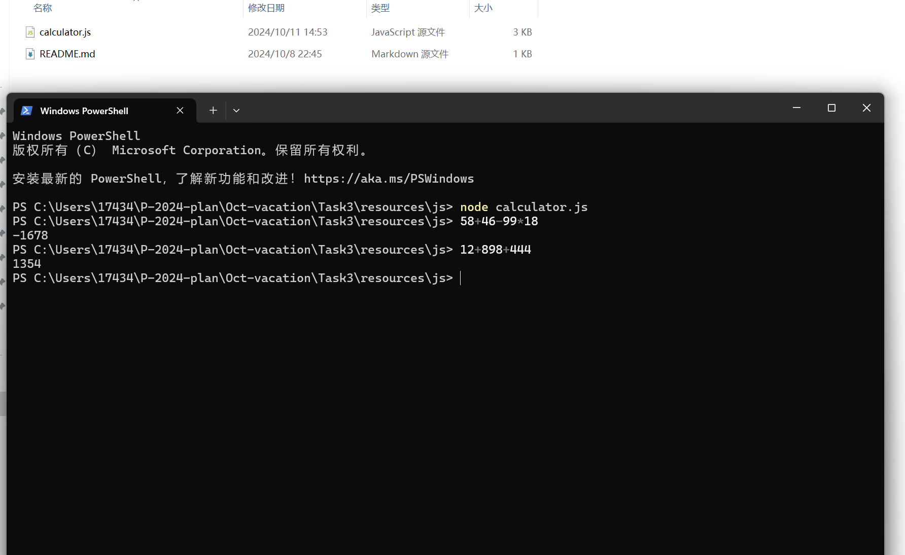

# Task 3

### 我的任务完成情况

找了一个 B 站的视频，照着配置完了环境，到目前一切顺利，然后尝试运行这个计算器程序，结果怎么都只能得到结果 4.1，十分奇怪地打开代码，发现是示例代码没有被写进注释，解决了这个问题后成功运行了程序。  

说来惭愧，对于第二个任务，本来想要实现添加幂运算这个功能的，但是尝试了一个下午，虽然代码的每一部分都有注释，但是还是没能做到，后面甚至让 AI 给我跑了一个，还是卡在输出这一步，在网上也没有找到对应的解决方法，无奈先放在一边了。
