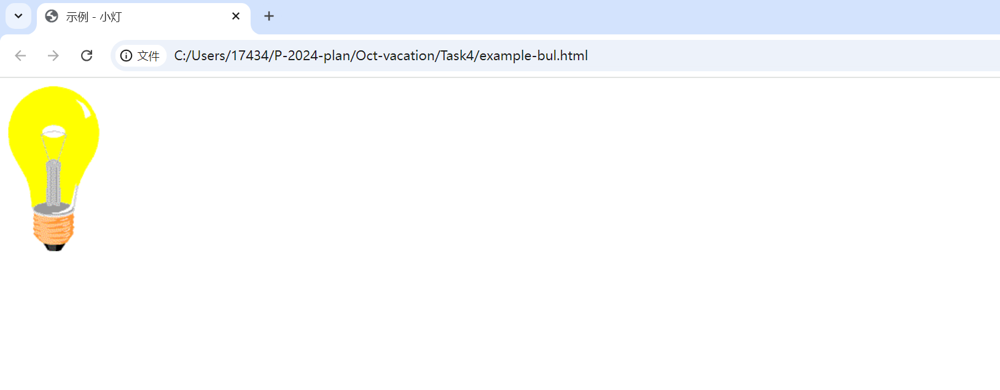
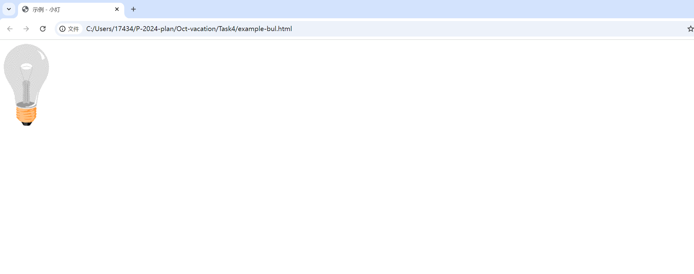

# Task 4

###我的完成情况  
参考了菜鸟教程 HTML 的相关示例与脚本教程，对于 HTML 的语法有了初步的理解，开始不知道为何图片路径明明没问题，但是就是显示出错，后面明白了是反斜杠没有被转义，处理了一下后可正常显示图片了，srds 还是不算完成了，因为我把原来的<script src:???>里面的 src 删去了，因为我发现如果不删掉就无法实现开灯的操作......  

